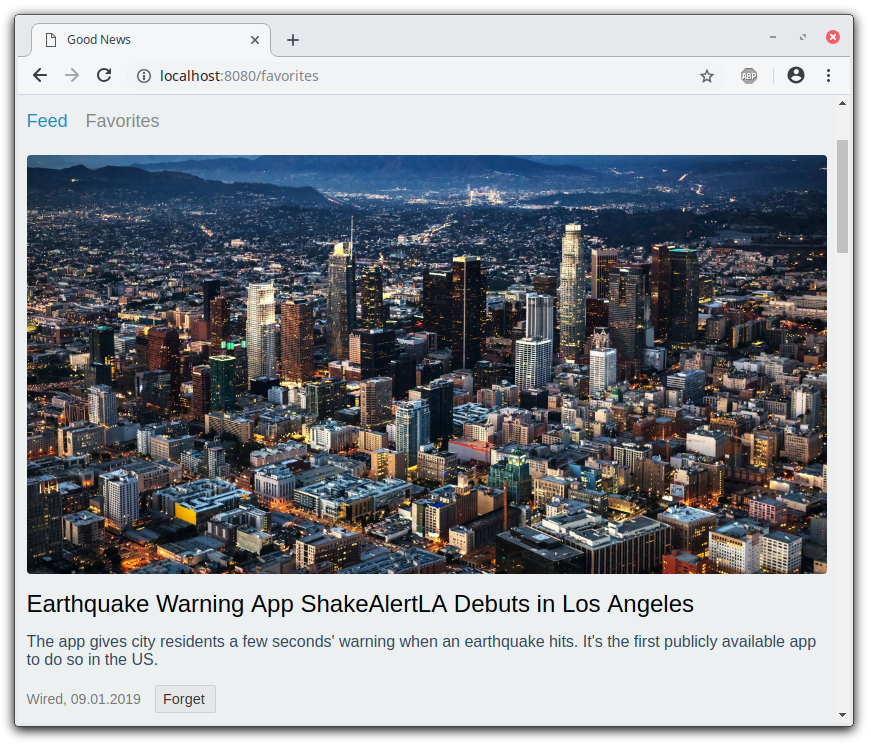

# Good News

[See live demo](https://vladimirlogachev.github.io/good-news/)

An infinite news feed, build with **TypeScript, React, Redux, Saga, Persist**

## Functional requirements

- User can click on a news item go to the source page in a new tab;
- User can save favorite articles _(and "forget" them)_;
- User can see saved articles in a separate route _(even after reloading a page)_;
- User can infinitely scroll news feed _(alternatively, there should be a pagination)_.

## Non-functional requirements

- Webpack, React, Redux;
- No boilerplates (create-react-app).

## Additional requirements

- Cover with tests _(TODO)_;
- Use static types with TypeScript/Flow;
- Changes in API data should not lead to crashes (all external datasets should be validated);
- User should be able to see saved articles after reloading a page.

## How to use

- `npm i` installs dependencies;
- `npm start` starts dev server;
- `npm run build`:
  - cleans `/build` directory;
  - builds for production into `/build` (ignored by Git, to be served from `static` path).
- `npm run publish`:
  - cleans `/docs` directory;
  - builds for production into `/docs` (used by GitHub Pages, has different path).

## Technical Decisions / Assumptions

- During saving articles are duplicated (but not cloned - same objects...) from one Dictionary to another, so that user can view saved items after reloading, even if they were on 50-th page of API.
